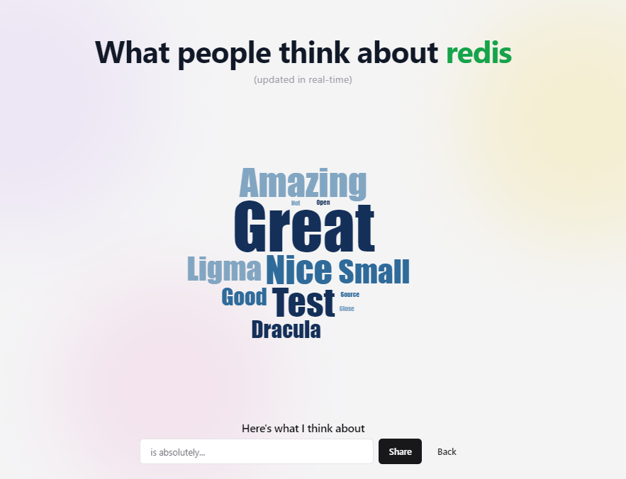

# Real-Time Opinion Word Cloud

 <!-- Update with actual image URL -->

This project is a real-time opinion word cloud application built with modern web technologies. Users can enter a topic and see a live word cloud that displays the most popular opinions. The app keeps track of the popular topics.

## Features

- Real-time word cloud generation based on user input
- Tracks the popular topics
- Uses MongoDB to store and update data
- Utilizes Socket.IO for real-time communication between users

## Tech Stack

- **Frontend:** React, TypeScript, TailwindCSS, ShadcnUI
- **Backend:** Node.js, Express
- **Database:** MongoDB
- **Real-time Communication:** Socket.IO

## Installation

1. Clone the repository:

   ```sh
   git clone https://github.com/J3E1/realtime-voting.git
   cd realtime-voting
    ```
2. Install dependencies of Server and client

3. Add `.env`

    ```
    # client
    VITE_SERVER_URL="http://localhost:5000"
    ```

    ```
    # server
    MONGODB_CONNECTION_STRING="your mongodb connection string"
    NODE_ENV="development"
    ```

4. Start server and client with `npm run dev`
